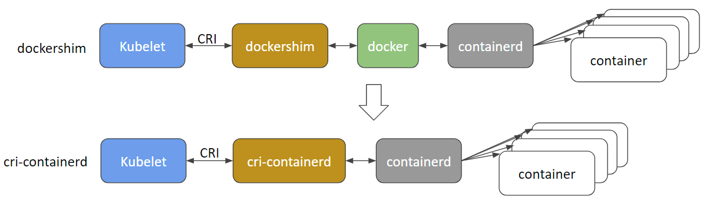

# Docker vs ContainerD

In the beginning Docker become the most dominent container tool because of its simplify user interface.
Than it comes Kubernetes which were desined to orchastrate docker containers. So they were tightly coupled
and K8s did support other container solutions.
So after time K8s introduced `Container Runtime Interface (CRI)` which allow any vendor to work as container runtime as log as they adhere to the `Open Container Initiative(OCI)` (imagespec and runtimespec).
But Docker does not support CRI standarts and so K8s introduced `dockershim` which support docker outside CRI.
Docker is not just a runtime tool. It consist of many things like CLI, API, build, support for volumes, auth, security and finally the container runtime called `containerD`.
ContainerD works with CRI so by itself it can be used as docker runtime.
And by the way `containerD` is now a separate project and can be installed without docker.


From version 1.24 K8s remove `dockershim` from support dropping the `Docker`.
But all images build by docker continue to work because they were build according to the OCI.

# CLI

### ctr

It comes with `containerD`. It is not user frendly. It is only for debugging and support limited features.

### nerdctl

1. Provides a Docker-like CLI for containerD
    ```console
    docker run --name redis redis:alpine => nerdctl run --name redis redis:alpine
    ```
2. Support docker compose.
3. Support newest features in containerD.
    - Encrypted container images.
    - Lazy Pulling
    - P2P image distribution.
    - Image signing and verifying.
    - Namespaces in Kubernetes.

### crictl

1. Is developed by K8s community and provides a CLI for CRI compatible container runtimes.
2. Installed separately.
3. Used to inspect and debug container runtimes. 
   Not to create containers ideally.
   ```console
    crictl pull busybox
    crictl images
    crictl ps -a
    crictl exec -it <containerID> ls
    crictl logs <containerID>
    crictl pods
   ```
4. Work across different runtimes.

By default it will use the following endpoint one by one in the following order if not specified.
```
unix:///var/run/dockershim.sock
unix:///run/containerd/containerd.sock
unix:///run/crio/crio.sock
unix:///var/run/cri-dockerd.sock
```

If we want ro specify a endpoint:
```console
crictl --runtime-endpoint
```
or
```console
export CONTAINER_RUNTIME_ENDPOINT
```