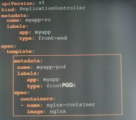
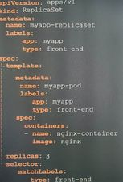
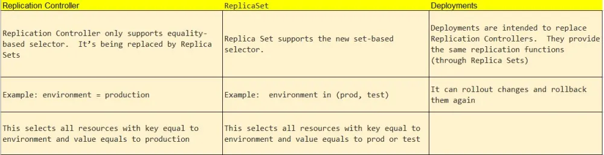

# ReplicationController

> **_NOTE:_** Old school!

A ReplicationController ensures that a specified number of pod replicas are running at any one time. In other words, a ReplicationController makes sure that a pod or a homogeneous set of pods is always up and available.

On the picture the only thing that is missing i the `replicas`. It is under RC spec as `template` sibling.

> **_NOTE:_** `ReplicationController` does not require a `selector`.

> **_NOTE:_**  The `ReplicationController` does not manage pods outside the pods created by the  `ReplicationController` itself. 

# ReplicationSet

A ReplicaSet's purpose is to maintain a stable set of replica Pods running at any given time. As such, it is often used to guarantee the availability of a specified number of identical Pods.

> **_NOTE:_** `ReplicationSet` requires a `selector`.

> **_NOTE:_**  The `ReplicationSet` can manage pods outside the pods created by the  `ReplicationSet` itself as long as the selector match the pods labels.

## Scale the ReplicaSet

- Use the ReplicaSet yaml definition and `replace` command to replace the RS.

    `kubectl replace -f rs-definition.yaml`

- Use `scale` command.

    `kubectl scale --replicas=6 -f rs-definition.yaml`

    `kubectl scale --replicas=6 replicaset my-rs`

# ReplicationController vs ReplicationSet

