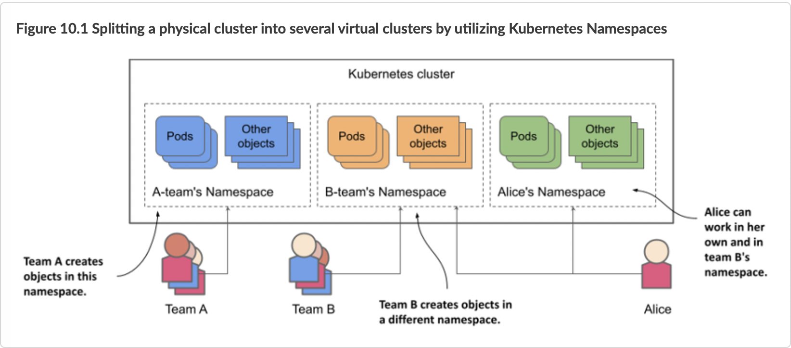

## Namespaces

In Kubernetes, namespaces provides a mechanism for isolating groups of resources within a single cluster. Names of resources need to be unique within a namespace, but not across namespaces. Namespace-based scoping is applicable only for namespaced objects (e.g. Deployments, Services, etc) and not for cluster-wide objects (e.g. StorageClass, Nodes, PersistentVolumes, etc).



### How to access service outside the namespace.

`<service><namespace>.svc.cluster.local`

`svc` specify that is a service.

`cluster.local` is the default domain.

### YAML definition.

```yaml
apiVersion: v1
kind: Namespace
metadata:
  name: dev
```

### Create Namespace

```console
kubectl create -f namespace-definition.yaml
```
```console
kubectl create namespace dev
```

### Get resources from a namespace

```console
kubectl --namespace=dev get pod
```

Or switch the kubectl context to use `dev` namespace by default.

```console
kubectl config set-context $(kubectl config current-context) --namespace=dev
```